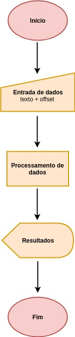

# Cifra de César

## Prefácio

Sua família possui uma forte tradição na culinária e sempre, nos almoços de domingo, vocês cozinham receitar que foram 
passadas de geração para geração, porém é consenso que as receitas não devem ser passada para outras pessoas. Até que 
chega um dia que você decide criar um livro contendo todas as receitas para ficar mais fácil de deixar ṕara as futuras 
gerações, e para não perder a tradição do mistério, você decide criar uma aplicação que codifique todas as receitas, assim
só saberá ler aquilo quem também tiver acesso ao sistema para decodificar os textos. 

## Introdução

A cifra de César é um dos primeiros tipos de criptografias conhecidos na história, ficou conhecida pois o imperador Júlio 
César utilizava essa cifra para trocar mensagens com os generais no campo de batalha sem que outras pessoas pudessem saber 
seus planos. Por meio dela, cada letra do texto é substituída por outra baseado em um número de deslocamento. 

## Objetivos

Essa aplicação busca facilitar o processo de codificar e decodificar uma mensagem para o usuário, sendo que o próprio usuário
que definirá o padrão de deslocamento que deseja utilizar para a função escolhida.

## Definição do usuário

O usuário que utilizará essa aplicação, estará buscando codificar ou decodificar uma receita culinária, portanto é importante 
ter uma área de texto que possibilite mudar de linhas e também considerar caracteres como números e espaço. O objetivo é
facilitar o processo para usuários de gerações diferentes, pois o programa será utilizado por toda a família.

## Diagrama de blocos

